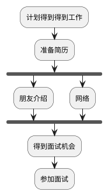
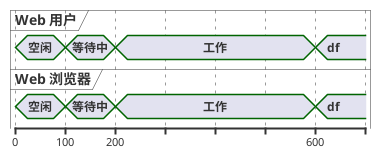
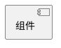

如何准备面试
<!-- more -->
# 怎么看待面试
## 面试流程

```puml
@startuml
    :计划得到得到工作;
    :准备简历;
    fork
        :朋友介绍;
    fork again
        :网络;
    end fork
    :得到面试机会;
    :参加面试;
@enduml
```
## 时序图

```puml
@startuml
concise "Web 用户" as WU
concise "Web 浏览器" as WB
@0
WU is 空闲
WB is 空闲
@100
WU is 等待中
WB is 等待中
@200
WU is 工作
WB is 工作
@600
WU is df
WB is df
@enduml
```
## 组件图

```puml
@startuml
[组件]
@enduml
```