使用简单的文字描述画UML图
<!-- more -->
## PlantUML简介
优秀类图源码展示
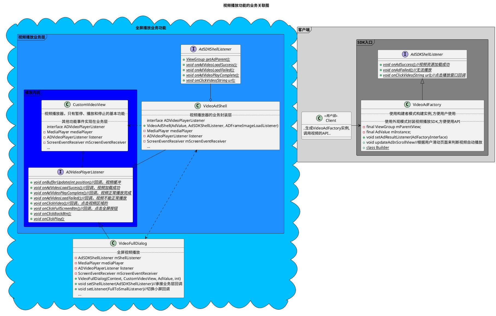
先来一个开口菜，概览功能
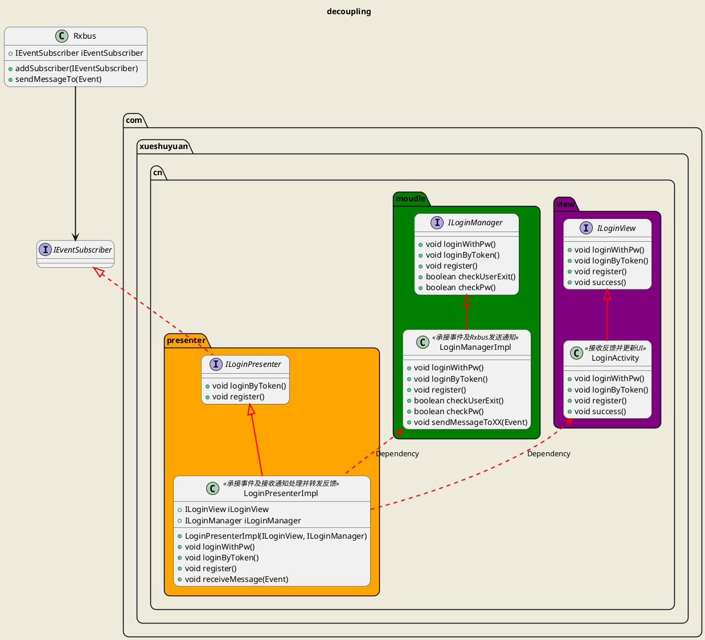
## 类定义
### 类之间关系定义
------
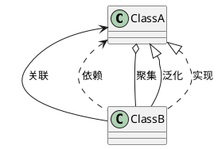
### 最简单的类定义
----
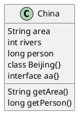
### 多样的类定义
----
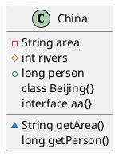
### 静态属性和抽象方法
----
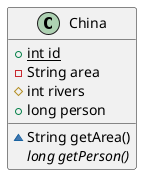
### 自定义类主题
----
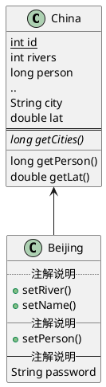
### 类图注释
----
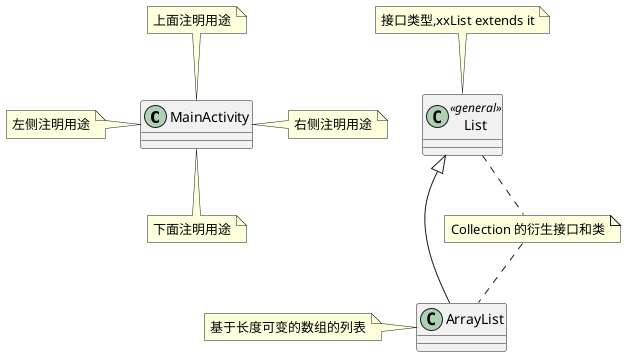
## 关于类、抽象类和接口的定义及关系
### 动物园的饲养员能够给各种各样的动物喂食，绘制逻辑，效果
----
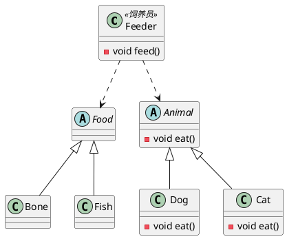
### 关于Set以及其衍生类之间的关系，绘制逻辑
----
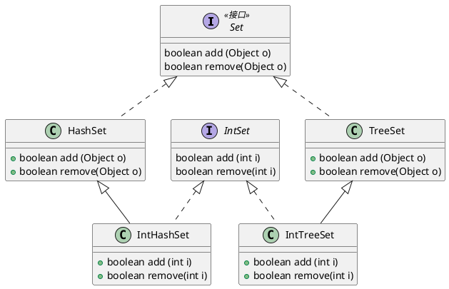
### 使用泛型功能的类图，效果
----
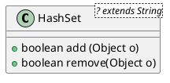
### 同属一个包下的类、抽象类和接口，效果
----
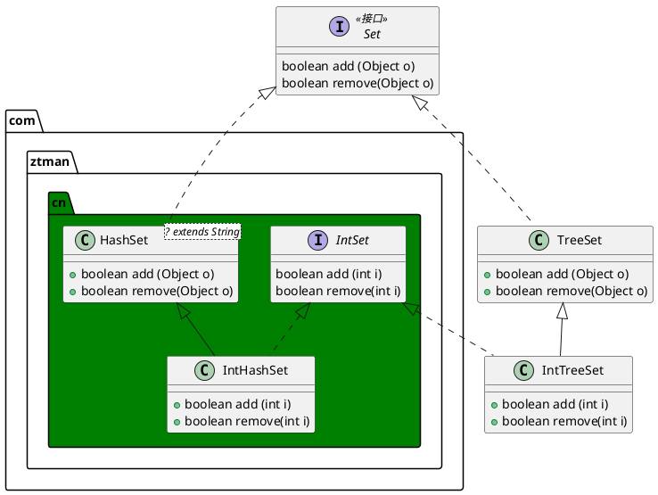
### 包与包之间建立关系，效果
----
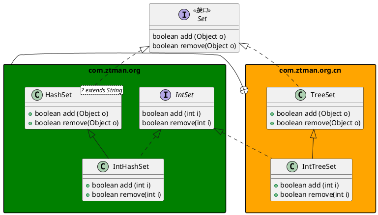
### 以命名空间分割，并在不同空间内类之间建立关系，效果
----
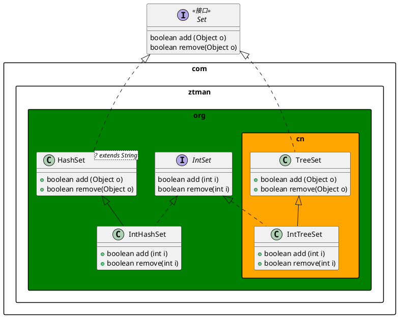
### 对于一些单个存在且不想展示出来的类图的类、属性和方法，我们可以将其隐藏。只需要在其类 class 前加hide即可，显示使用show