时序图（Sequence Diagram），通过描述对象之间发送消息的时间顺序显示多个对象之间的动态协作。
<!-- more -->
## 简单例子
```
@startuml
张三 -> 李四 : 我要借钱
李四 --> 张三 : 借给你
张三 -> 李四 : 我要还钱
李四 --> 张三 : 收到欠款
@enduml
```
```puml
张三 -> 李四 :我要借钱
李四 --> 张三 : 借给你
张三 -> 李四 : 我要还钱
李四 --> 张三 : 收到欠款
```
## 代码注释
在uml文档中，使用单引号’ 表示该行后面的都为注释。如果需要注释多行，则使用/’ 和 ‘/作为注释的开始和结束。
例如对前面的示例代码进行注释：
```
@startuml
张三 -> 李四 : 我要借钱
'李四 --> 张三 : 借给你
/'张三 -> 李四 : 我要还钱
李四 --> 张三 : 收到欠款'/
@enduml
```
得到时序图如下：
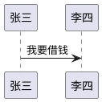
## 声明参与者对象
可以通过事先声明的方式，使参与者在时序图中保持确定的顺序。声明可以使用participant关键字，除此以外，还可以使用以下关键字：
* actor
* boundary
* control
* entity
* database

使用这些关键字画出的参与者对象的图案稍有不同，但是含义相同。示例如下：
```
@startuml

participant par
actor act
boundary bou
control con
entity ent
database dat

par->act : to actor
par->bou : to  boundary
par->con : to control
par->ent : to entity
par->dat : to database

@enduml
```
得到如下：
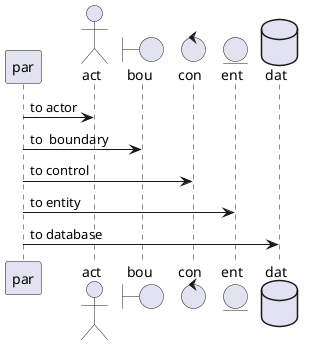
另外，还可以在声明参与者对象的时候，通过as关键字来为对象赋予一个简单的别名，需要注意图中显示的字要用双引号引起来。除此之外，声明时还可以对对象的图案指定背景颜色。
示例如下：
```
@startuml

participant "我是很长的一段话，如果要用我来表达的话，就太长了吧！" as par
actor act #FF0000
boundary bou #00FF00
control con #0000FF
entity ent #FFFF00
database dat #00FFFF

par->act : to actor
par->bou : to  boundary
par->con : to control
par->ent : to entity
par->dat : to database

@enduml
```
得到：
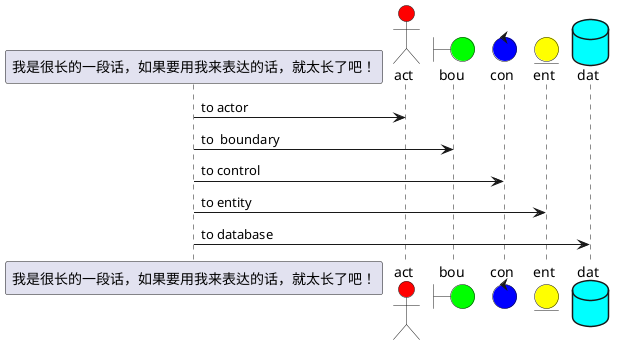
## 双引号非声明的参与者对象
我们可以在箭头指向对象的时候，直接使用非声明的对象。并且，对于长句子，或者有特殊符号的字符串，可以使用双引号引起来。在箭头指向的语句中，也可以通过as关键字，为双引号定义的参与者对象设置别名。
```
@startuml

张三 -> "Tom()" : Hello
"Tom()" -> "牛儿还在山上吃草，放牛的却不知道哪里去了的王二小" as wang : Hi
wang --> "Tom()" : How are you

@enduml
```
得到
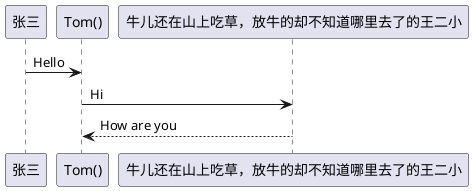
## 发给自己的消息
```
@startuml

张三 -> "Tom()" : Hello
"Tom()" -> "牛儿还在山上吃草，放牛的却不知道哪里去了的王二小" as wang : Hi
wang --> "Tom()" : How are you
wang -> wang : 我要把鬼子引到埋伏圈去！\n 让八路军把这些鬼子都干掉~

@enduml
```
得到
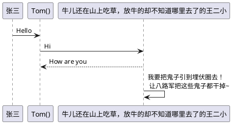
## 箭头类型
* 时序图的箭头除了常用的->以外，还可以指定不同类型的箭头。它们分别是：
* 箭头末端为一把叉。表示消息丢失。
* 使用\或者/来代替<和>,可以得到只有上半部或者下半部的箭头。
* 使用两个箭头符号（\\、//或者>>、<<），使箭头变为细线箭头。
* 使用--代替-，可以变为虚线箭头。
* 在箭头末尾增加一个o，可以在箭头末尾增加一个O。
* 可以使用双向箭头。

为了更直观的展示箭头样式，请看下面的示例：
```
@startuml

阴 -> 阳
阴 --> 阳
阴 ->x 阳
阴 ->> 阳
阴 -\ 阳
阴 -\\ 阳
阴 /-- 阳
阴 //-- 阳
阴 ->o 阳
阴 <-> 阳
阴 <-->o 阳
阴 o<-->x 阳

@enduml

```
得到
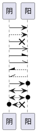
## 箭头颜色
箭头除了类型可以变化外，箭头的颜色也是可以改变的。指定箭头颜色的方式，就是在箭头符号的第一个字符后插入颜色标记[#color]。
例如：
```
@startuml

树木 -[#green]> 树林
树林 -[#00FF00]> 森林
树林 <[#red]-- 森林 
树木 <[#FF0000]-- 树林

@enduml
```
得到
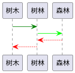
## 消息数字序号
很多时候，时序图消息太多，我们需要在消息上增加序号以理清先后顺序。在PlantUML中，我们可以使用autonumber关键字，就可以自动为消息加上数字序号。例如：
```
@startuml
autonumber

张三 -> 李四 : 我要借钱
李四 --> 张三 : 借给你
张三 -> 李四 : 我要还钱
李四 --> 张三 : 收到欠款

@enduml
```
得到
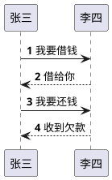
autonumber除了这样单独使用外，还可以指定开始的数字序号，和每次递增的数字。如果只使用开始序号，则使用autonumber 'start'，如果还需要指定每次递增的数字，则使用autonumber 'start' 'increment'。例如：
```
@startuml
autonumber

张三 -> 李四 : 我要借钱
李四 --> 张三 : 借给你

autonumber 12

张三 -> 李四 : 我要还钱
李四 --> 张三 : 收到欠款

autonumber 20 5

张三 -> 李四 : 我还要借钱
李四 --> 张三 : 不借了

@enduml
```
得到
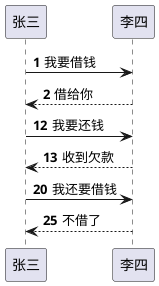
另外，我们还可以指定数字序号的格式。使用方法是在autonumber后用双引号指定数字序号格式。数字需要的格式指定方式为Java的DecimalFormat方式。（0表示数字，不足的时候占位，#表示数字，不足时不占位）。在格式化的双引号中，还可以使用一些html标签。例如：
```
@startuml
autonumber "<b>[000]"

张三 -> 李四 : 我要借钱
李四 --> 张三 : 借给你

autonumber 12 "<b>(<u>###</u>)"

张三 -> 李四 : 我要还钱
李四 --> 张三 : 收到欠款

autonumber 20 5 "<font color=red>MSG #"

张三 -> 李四 : 我还要借钱
李四 --> 张三 : 不借了

@enduml
```
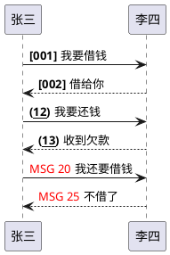
除此之外，还可以使用autonumber stop停止消息序列计数，然后再通过autonumber resume 'increment' 'format'，继续计数。这里就不再写例子示范了。
## 标题
title关键字，可以为时序图指定标题。例如：
```
@startuml

title 借钱与还钱的故事

张三 -> 李四 : 我要借钱
李四 --> 张三 : 借给你

@enduml
```
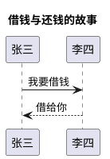
## 图表说明
legend关键字与endlegend关键字配合使用，为图表配一段说明文字。可以指定right、left或者center来指定说明的对齐位置。例如：
```
@startuml

legend center
这是一个借钱与还钱发生的故事。
故事发生在一个夜黑风高的晚上……
endlegend

张三 -> 李四 : 我要借钱
李四 --> 张三 : 借给你

@enduml
```
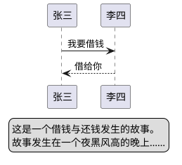
## 图表分割
当时序图过长，或者处于某种逻辑考虑时，需要将图表分割为几部分。这时可以使用newpage关键字。例如
```
@startuml

张三 -> 李四 : 我要借钱
李四 --> 张三 : 借给你

newpage

张三 -> 李四 : 我要还钱
李四 --> 张三 : 收到欠款

newpage 最后的标题

张三 -> 李四 : 我还要借钱
李四 --> 张三 : 不借了

@enduml
```
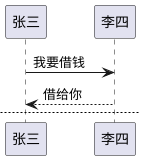
## 消息分组
为了让时序图消息更有逻辑性，我们常需要对消息进行分组框起来。在PlantUML中，可以使用一下关键字对消息进行分组：
* alt/else
* opt
* loop
* par
* break
* critical
* group (后接需要显示的字符)

除了group以外，其他关键词后可以接字符串，让其显示在分组框的上方居中位置。另外，分组之间可以嵌套。例如：
```
@startuml

alt 借钱案例
张三 -> 李四 : 我要借钱

loop 循环借钱100次
group 成功案例
李四 --> 张三 : 借给你
end

张三 -> 李四 : 我要还钱
李四 --> 张三 : 收到欠款
end

else 借钱失败
张三 -> 李四 : 我还要借钱
李四 --> 张三 : 不借了

end

@enduml
```
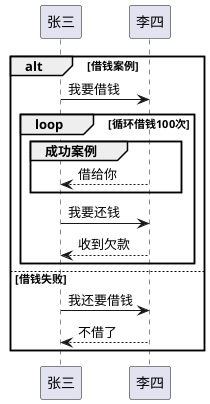
## 为消息添加注释
很多时候，我们需要在时序图中对消息进行注释，以便做详细的说明。在PlantUML中，可以紧跟消息箭头语句之后，使用note left或者note right关键字来添加注释。如果注释有多行，可以在多行注释后，通过end note来结束注释。示例：
```

@startuml

张三 -> 李四 : 我要借钱
note left: 我借钱肯定会还你的！

李四 --> 张三 : 借给你
note right: 我相信你肯定会还我钱的！

张三 -> 李四 : 我要还钱
note left
有借有还，
再借不难！
end note

李四 --> 张三 : 收到欠款
note right: 有诚信！

张三 -> 李四 : 我还要借钱
李四 --> 张三 : 不借了

@enduml
```
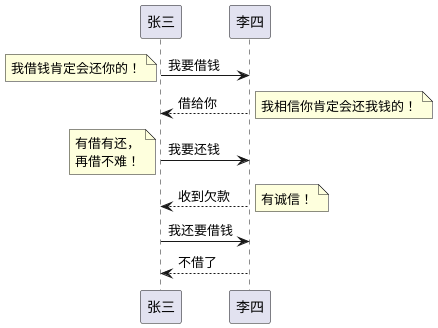
## 为参与者对象添加注释
注释除了添加到消息外，还可以直接在时序图中添加到参与者对象上。使用note left of，note right of或note over关键字即可实现。同样，可以在关键字语句后加颜色来改变注释的颜色。另外，也可以与note end组合使用，来添加多行注释。
```
@startuml

participant 张三
participant 李四

note left of 张三 #00FF00
我的名字叫张三，
家里有房又有田。
谁知来了个李四，
从此生活大变样。
end note

note right of 李四: 我是李四大哥

note over 张三: 谁敢比我惨~~~

note over 李四: 我比你更惨~~~

note over 张三,李四 #red
左手一只鸡，
右手一只鸭，
不得禽流感算我瞎！
end note

@enduml

```
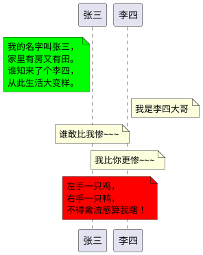
## 注释的形状
注释除了note的形状以外，还可以使用hnote和rnote。hnote表示六边形，rnote表示长方形。示例：
```
@startuml

participant 张三
participant 李四

rnote left of 张三 #00FF00
我的名字叫张三，
家里有房又有田。
谁知来了个李四，
从此生活大变样。
end note

note right of 李四: 我是李四大哥

note over 张三: 谁敢比我惨~~~

note over 李四: 我比你更惨~~~

hnote over 张三,李四 #red
左手一只鸡，
右手一只鸭，
不得禽流感算我瞎！
end note

@enduml
```
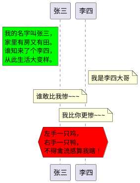
## Creole和HTML格式
```
**黑体**
//斜体//
""等宽字体""
--删除线--
__下划线__
~~ 波浪线~~
## 除此外，在note中还可以使用一些html标签：
<back:red></back> 背景色
<size:18></size> 字体大小
<u:red></u> 下划线
<color red></color> 字体颜色
<s:red></strike> 删除线
<w:FF33FF></w> 波浪线
 图片
```
示例：
```
@startuml

participant 张三
participant 李四

张三 -> 李四 : **我要借钱**
note left: ~~我借钱肯定会还你的！~~

李四 --> 张三 : <color red>借给你</color>
note right: <u:blue>我相信你肯定会<s:green>还我钱</s>的！</u>

张三 -> 李四 : **<size:20>我要还钱</size>**
note left
<color blue>~~有借有还，~~</color>
<color pink>--再借不难！--</color>
end note

李四 --> 张三 : 收到欠款
note right: 有诚信！

张三 -> 李四 : 我还要借钱
李四 --> 张三 : 不借了

@enduml
```
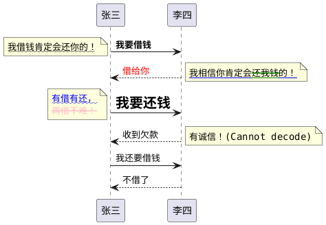
## 分割线
我们可以将时序图按照逻辑步骤，使用分割线，将时序图分割为多个不同的步骤阶段。分割线是需要使用==关键字。示例：
```
@startuml

== 借钱阶段 ==

张三 -> 李四 : 我要借钱
李四 --> 张三 : 借给你

== 还钱阶段 ==

张三 -> 李四 : 我要还钱
李四 --> 张三 : 收到欠款

== 再次借钱阶段 ==

张三 -> 李四 : 我还要借钱
李四 --> 张三 : 不借了

@enduml
```
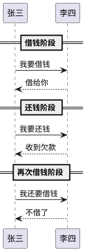
## 引用
使用ref over可以为参与者对象指定引用组件。示例
```
@startuml

participant 杰瑞
actor 汤姆

ref over 杰瑞,汤姆 : 初始化

杰瑞 -> 汤姆 : Hello~

ref over 汤姆
多行表达，
就应该这样！
end ref

@enduml
```
```puml
@startuml

participant 杰瑞
actor 汤姆

ref over 杰瑞,汤姆 : 初始化

杰瑞 -> 汤姆 : Hello~

ref over 汤姆
多行表达，
就应该这样！
end ref

@enduml
```
## 延时
在时序图中，我们可以指定两条消息之间的延时。并且可以为这个延时添加文字说明。需要使用的关键字为...。示例：
```
@startuml

张三 -> 李四 : 我要借钱
李四 --> 张三 : 借给你

... 八百年后 ...

张三 -> 李四 : 我要还钱
李四 --> 张三 : 收到欠款

... 一天后 ...

张三 -> 李四 : 我还要借钱
李四 --> 张三 : 不借了

@enduml
```
```puml
@startuml

张三 -> 李四 : 我要借钱
李四 --> 张三 : 借给你

... 八百年后 ...

张三 -> 李四 : 我要还钱
李四 --> 张三 : 收到欠款

... 一天后 ...

张三 -> 李四 : 我还要借钱
李四 --> 张三 : 不借了

@enduml
```
## 间隔空间
使用|||关键字可以为上下两条内容多分隔出一定空间。另外，还可以使用||45||来指定分隔空间的具体像素。示例：
```
@startuml

张三 -> 李四 : 我要借钱
李四 --> 张三 : 借给你
|||
张三 -> 李四 : 我要还钱
李四 --> 张三 : 收到欠款
||50||
张三 -> 李四 : 我还要借钱
李四 --> 张三 : 不借了

@enduml
```
```puml
@startuml

张三 -> 李四 : 我要借钱
李四 --> 张三 : 借给你
|||
张三 -> 李四 : 我要还钱
李四 --> 张三 : 收到欠款
||50||
张三 -> 李四 : 我还要借钱
李四 --> 张三 : 不借了

@enduml
```
## 生命线的激活与销毁
activate和deactivate关键字用来指明参与者对象的活跃周期。当一个参与者对象被激活，则表示它的活跃周期开始，生命线变为长方形。activate和deactivate关键词用在触发激活的消息之后。

除此外，还可以使用destroy关键字，它表示参与者对象的生命线结束。示例：
```
@startuml

张三 -> 李四 : 我要借钱
activate 张三
activate 李四

李四 -> 王五 : 你给他担保我才借
activate 王五

王五 --> 李四 : 我给他担保 
destroy 王五

李四 --> 张三 : 借给你

张三 -> 李四 : 我要还钱
李四 --> 张三 : 收到欠款
deactivate 李四

张三 -> 李四 : 我还要借钱
李四 --> 张三 : 不借了
deactivate 张三

@enduml
```
```puml
@startuml

张三 -> 李四 : 我要借钱
activate 张三
activate 李四

李四 -> 王五 : 你给他担保我才借
activate 王五

王五 --> 李四 : 我给他担保 
destroy 王五

李四 --> 张三 : 借给你

张三 -> 李四 : 我要还钱
李四 --> 张三 : 收到欠款
deactivate 李四

张三 -> 李四 : 我还要借钱
李四 --> 张三 : 不借了
deactivate 张三

@enduml
```
除此外，生命线还可以嵌套。也就是一个参与者对象可以多次activate和deactivate。另外，可以为生命线指定背景色。示例：
```
@startuml

张三 -> 李四 : 我要借钱
activate 张三
activate 李四

李四 -> 李四 : 四处筹钱
activate 李四 #FFBBBB

李四 -> 王五 : 你给他担保我才借
activate 王五

王五 --> 李四 : 我给他担保 
destroy 王五

deactivate 李四

李四 --> 张三 : 借给你

张三 -> 李四 : 我要还钱
李四 --> 张三 : 收到欠款
deactivate 李四

张三 -> 李四 : 我还要借钱
李四 --> 张三 : 不借了
deactivate 张三

@enduml
```
```puml
@startuml

张三 -> 李四 : 我要借钱
activate 张三
activate 李四

李四 -> 李四 : 四处筹钱
activate 李四 #FFBBBB

李四 -> 王五 : 你给他担保我才借
activate 王五

王五 --> 李四 : 我给他担保 
destroy 王五

deactivate 李四

李四 --> 张三 : 借给你

张三 -> 李四 : 我要还钱
李四 --> 张三 : 收到欠款
deactivate 李四

张三 -> 李四 : 我还要借钱
李四 --> 张三 : 不借了
deactivate 张三

@enduml
```
## 动态创建参与者对象
在这之前，我们讨论的情况都是参与者在时序图一开始的时候都已经存在。然而实践中，我们经常会遇到某些参与者对象是在时序图的某个阶段才动态创建出来的。

在PlantUML中，我们可以使用create关键字来动态创建参与者对象。其后紧跟一条发送给它的消息，以表明是由这条消息触发了创建这个参与者对象。示例：
```
@startuml

张三 -> 李四 : 我要借钱
activate 张三
activate 李四

李四 -> 张三 : 风险有点大，有担保吗？

create 王五
张三 -> 王五 : 我来虚拟个担保人
activate 王五

王五 --> 李四 : 我给他担保 
destroy 王五

李四 --> 张三 : 借给你

张三 -> 李四 : 我要还钱
李四 --> 张三 : 收到欠款
deactivate 李四

张三 -> 李四 : 我还要借钱
李四 --> 张三 : 不借了
deactivate 张三

@enduml

```
```puml
@startuml

张三 -> 李四 : 我要借钱
activate 张三
activate 李四

李四 -> 张三 : 风险有点大，有担保吗？

create 王五
张三 -> 王五 : 我来虚拟个担保人
activate 王五

王五 --> 李四 : 我给他担保 
destroy 王五

李四 --> 张三 : 借给你

张三 -> 李四 : 我要还钱
李四 --> 张三 : 收到欠款
deactivate 李四

张三 -> 李四 : 我还要借钱
李四 --> 张三 : 不借了
deactivate 张三

@enduml

```
## 进出消息
当我们需要将注意力放在一个参与者对象时，我们只关心它的消息进出情况。因此，这样的时序图只需要一个参与对象，然后通过[和]配合箭头来表示进出消息。示例：
```
@startuml

张三 ->] : 我要借钱
activate 张三

[--> 张三 : 风险有点大，有担保吗？
activate 张三 #FFBBBB

张三 -> 张三 : 我来虚拟个担保人

[--> 张三 : 借给你
deactivate 张三

张三 ->] : 我要还钱
[--> 张三 : 收到欠款


张三 ->] : 我还要借钱
[--> 张三 : 不借了
deactivate 张三

@enduml
```
```puml
@startuml

张三 ->] : 我要借钱
activate 张三

[--> 张三 : 风险有点大，有担保吗？
activate 张三 #FFBBBB

张三 -> 张三 : 我来虚拟个担保人

[--> 张三 : 借给你
deactivate 张三

张三 ->] : 我要还钱
[--> 张三 : 收到欠款


张三 ->] : 我还要借钱
[--> 张三 : 不借了
deactivate 张三

@enduml
```
## 固定版式和字母标记
在参与者对象声明时，使用<<和>>可以生成固定版式标记。在这个版式中，可以使用指定颜色的圆圈的字母标记。标记的方法是，在版式中使用(X,color)。示例：
```
@startuml

participant "放牛的王二小" as 王 <<自动生成>>
participant 鬼子 <<(O,#FF0000) 自动生成>>

王 -> 鬼子 : 带你去埋伏圈  

@enduml
```
```puml
@startuml

participant "放牛的王二小" as 王 <<自动生成>>
participant 鬼子 <<(O,#FF0000) 自动生成>>

王 -> 鬼子 : 带你去埋伏圈  

@enduml
```
固定版式中可以没有字符，这样就可以只有字母标记了。示例：
```
@startuml

participant "放牛的王二小" as 王 <<(X,#00FF00)>>
participant 鬼子 <<(O,#FF0000)>>

王 -> 鬼子 : 带你去埋伏圈  

@enduml
```
```puml
@startuml

participant "放牛的王二小" as 王 <<(X,#00FF00)>>
participant 鬼子 <<(O,#FF0000)>>

王 -> 鬼子 : 带你去埋伏圈  

@enduml
```
## 参与者对象组合
有时候多个参与者对象构成了一个更大的逻辑对象。这时，我们可以将这多个参与者对象用一个框框起来，表达它们逻辑上的关联。为了画出这样的需求，我们可以使用box和end box组合来将参与者对象放到一起。box关键字后面，可以接一个方框的标题，和指定方框的背景色。示例：
```
@startuml

box "解放军部队" #LightBlue
participant 将军
participant 士兵
end box

participant 敌人

将军 -> 士兵 : 指挥
士兵 -> 敌人 : 消灭

@enduml
```
```puml
@startuml

box "解放军部队" #LightBlue
participant 将军
participant 士兵
end box

participant 敌人

将军 -> 士兵 : 指挥
士兵 -> 敌人 : 消灭

@enduml
```
## 去掉底部的重复参与者对象
之前我们画出的所有时序图，顶部和底部都对称地显示了相同的参与者对象。为了图标更为简洁，我们有时需要去掉底部重复的对象，也可以表达相同的含义。这时，我们需要使用hide footbox关键字。示例：
```
@startuml

hide footbox
title "八年抗战开始了"

box "解放军部队" #LightBlue
participant 将军
participant 士兵
end box

participant 敌人

将军 -> 士兵 : 指挥
士兵 -> 敌人 : 消灭

@enduml
```
```puml
@startuml

hide footbox
title "八年抗战开始了"

box "解放军部队" #LightBlue
participant 将军
participant 士兵
end box

participant 敌人

将军 -> 士兵 : 指挥
士兵 -> 敌人 : 消灭

@enduml
```
## 皮肤参数
--------------
为了时序图更美观，PlantUML还可以使用skinparam关键字来统一定义字体、颜色以及其他外观风格。先看一个简单的例子：
```
@startuml

skinparam sequenceArrowThickness 2
skinparam roundcorner 20
skinparam maxmessagesize 60
skinparam sequenceParticipant underline

张三 -> 李四 : 我要借钱
activate 张三
activate 李四

李四 -> 李四 : 四处筹钱
activate 李四 #FFBBBB

李四 -> 王五 : 你给他担保我才借
activate 王五

王五 --> 李四 : 我给他担保 
destroy 王五

deactivate 李四

李四 --> 张三 : 借给你

张三 -> 李四 : 我要还钱
李四 --> 张三 : 收到欠款
deactivate 李四

张三 -> 李四 : 我还要借钱
李四 --> 张三 : 不借了
deactivate 张三

@enduml
```
```puml
@startuml

skinparam sequenceArrowThickness 2
skinparam roundcorner 20
skinparam maxmessagesize 60
skinparam sequenceParticipant underline

张三 -> 李四 : 我要借钱
activate 张三
activate 李四

李四 -> 李四 : 四处筹钱
activate 李四 #FFBBBB

李四 -> 王五 : 你给他担保我才借
activate 王五

王五 --> 李四 : 我给他担保 
destroy 王五

deactivate 李四

李四 --> 张三 : 借给你

张三 -> 李四 : 我要还钱
李四 --> 张三 : 收到欠款
deactivate 李四

张三 -> 李四 : 我还要借钱
李四 --> 张三 : 不借了
deactivate 张三

@enduml
```
除此外，PlantUML还支持更多的呈现风格个性化，特别是手写风格看起来非常个性化。例如下面一个稍复杂的例子：
```
@startuml

skinparam backfroundColor #EEEBDC
skinparam handwritten true

skinparam sequence {

    ArrowColor DeepSkyBlue
    ActorBorderColor blue
    LifeLineBorderColor blue
    LifeLineBackgroundColor #A9DCDF

    ParticipantBorderColor DeepSkyBlue
    ParticipantBackgroundColor DodgerBlue
    ParticipantFontName Aapex
    ParticipantFontColor #A9DCDF

    ActorBackgroundColor aqua
    ActorFontColor DeepSkyBlue
    ActorFontSize 17
    ActorFontName Aapex
}

张三 -> 李四 : 我要借钱
activate 张三
activate 李四

李四 -> 李四 : 四处筹钱
activate 李四 #FFBBBB

李四 -> 王五 : 你给他担保我才借
activate 王五

王五 --> 李四 : 我给他担保 
destroy 王五

deactivate 李四

李四 --> 张三 : 借给你

张三 -> 李四 : 我要还钱
李四 --> 张三 : 收到欠款
deactivate 李四

张三 -> 李四 : 我还要借钱
李四 --> 张三 : 不借了
deactivate 张三

@enduml
```
```puml
@startuml

skinparam backfroundColor #EEEBDC
skinparam handwritten true

skinparam sequence {

    ArrowColor DeepSkyBlue
    ActorBorderColor blue
    LifeLineBorderColor blue
    LifeLineBackgroundColor #A9DCDF

    ParticipantBorderColor DeepSkyBlue
    ParticipantBackgroundColor DodgerBlue
    ParticipantFontName Aapex
    ParticipantFontColor #A9DCDF

    ActorBackgroundColor aqua
    ActorFontColor DeepSkyBlue
    ActorFontSize 17
    ActorFontName Aapex
}

张三 -> 李四 : 我要借钱
activate 张三
activate 李四

李四 -> 李四 : 四处筹钱
activate 李四 #FFBBBB

李四 -> 王五 : 你给他担保我才借
activate 王五

王五 --> 李四 : 我给他担保 
destroy 王五

deactivate 李四

李四 --> 张三 : 借给你

张三 -> 李四 : 我要还钱
李四 --> 张三 : 收到欠款
deactivate 李四

张三 -> 李四 : 我还要借钱
李四 --> 张三 : 不借了
deactivate 张三

@enduml
```
## 结束语
到这里，使用PlantUML画时序图的捣鼓就告一个段落了。最后放上一个最近工作中画的一个物联网设备APP端调用支付宝充值服务费的时序图来结束本文吧~