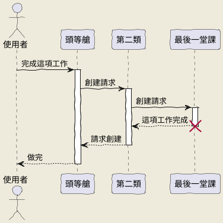
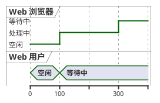
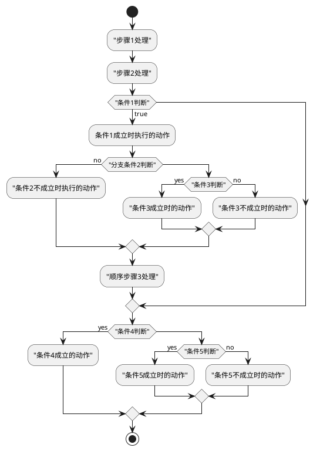
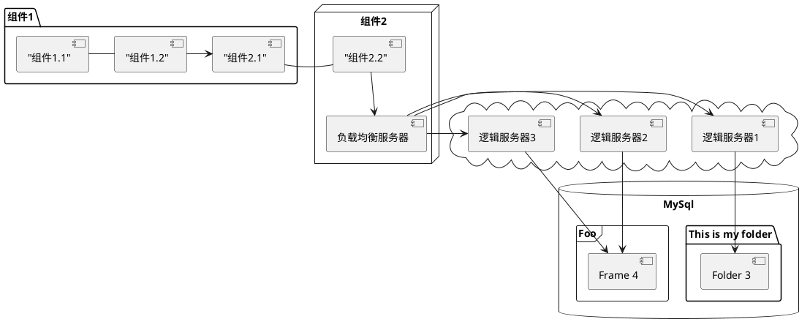
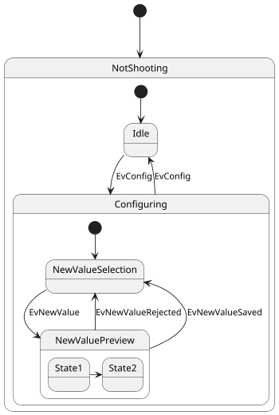
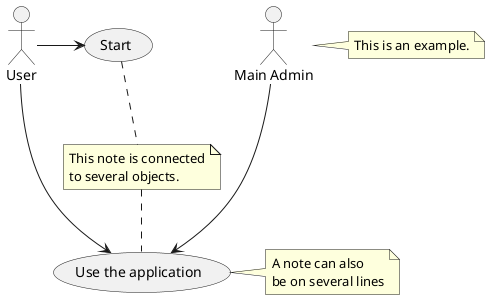
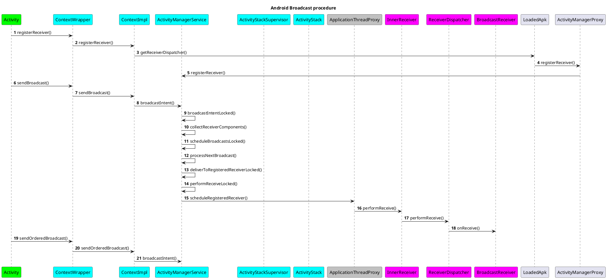
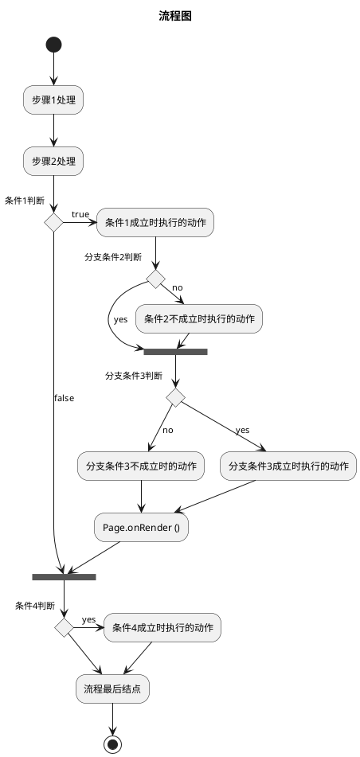

摘要
<!-- more -->
## 用例图

## 流程

## 组件
--------

## 状态图

## 用例图：

## 流程案例

流程图

### 参考网址
https://blog.csdn.net/zh_weir/article/details/72675013
https://blog.csdn.net/geduo_83/article/details/86422485
https://blog.csdn.net/zh_weir/article/details/72675013
https://blog.csdn.net/junhuahouse/article/details/80767632
https://blog.csdn.net/YangDongChuan1995/article/details/81842652
https://blog.csdn.net/wxb141001yxx/article/details/53365514 
https://blog.csdn.net/shiqijiamengjie/article/details/25191321
https://blog.csdn.net/degwei/article/details/51489444

[snap.svg](https://www.zhangxinxu.com/GitHub/demo-Snap.svg/demo/basic/)
http://www.php.cn/
http://phpstudy.php.cn/css3/
http://phpstudy.php.cn/