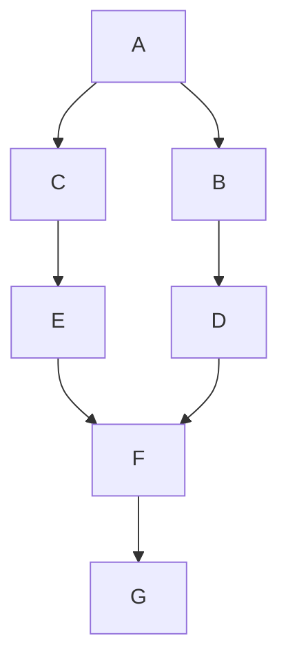
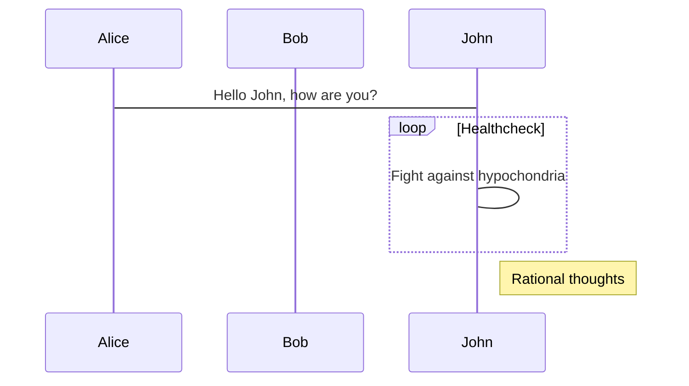
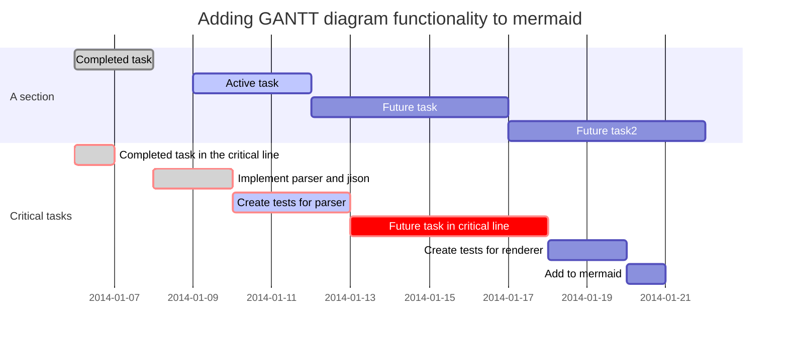

这是摘要

<!-- more -->

# 标题
# 这是一级标题
## 这是二级标题
### 这是三级标题
#### 这是四级标题
##### 这是五级标题
###### 这是六级标题
# 二、字体
**这是加粗的文字**
*这是倾斜的文字*`
***这是斜体加粗的文字***
~~这是加删除线的文字~~
# 三、引用
>这是引用的内容
>>这是引用的内容
# 四、分割线
---
----
***
*****
# 五、图片


# 六、超链接
[百度](http://baidu.com "百度")

# 七、列表

- 列表内容
   - 水电费
   - 水电费
   - 水电费
+ 列表内容
* 列表内容

# 八、表格
## 原生语法
姓名|技能|排行
:--:|:--|:--:|
刘备|哭|大哥
关羽|打|二哥
张飞|骂|三弟

## html语法

# 九、代码
`echo 34 #代码内容`

```javascript
    function fun(){
         echo "这是一句非常牛逼的代码";
    }
    fun();
```
# 流程图

# 时序图

甘特图
