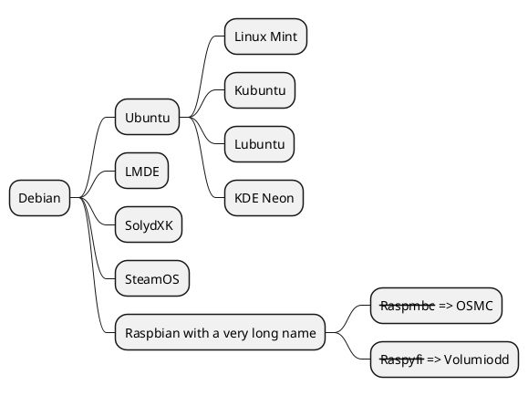

常用网址
<!-- more -->
## 这一用plantuml划mapmind

## 前端
一个有关开发的资源技术参考的网站https://www.runoob.com
https://angular.cn/
https://panjiachen.github.io/vue-element-admin-site/zh/guide/
https://cn.vuejs.org/v2/guide/
https://vue-loader-v14.vuejs.org/zh-cn/
https://panjiachen.gitee.io/vue-element-admin-site/zh/
https://router.vuejs.org/zh/
https://www.webpackjs.com/
http://es6.91fox.cn/
https://cli.vuejs.org/zh/
http://cn.redux.js.org/
https://element.eleme.cn/#/zh-CN
http://mockjs.com/
https://c.runoob.com/more/svgeditor/
https://www.gruntjs.net/
http://www.axios-js.com/zh-cn/docs/
https://zh-hans.reactjs.org/
http://www.ruanyifeng.com/blog/2018/06/javascript-this.html
https://ejs.bootcss.com/
https://www.cnblogs.com/mirandachen/p/9826886.html
https://blog.csdn.net/xuaa/article/details/52262586
http://www.ruanyifeng.com/blog/2015/05/commonjs-in-browser.html
http://www.ruanyifeng.com/blog/2019/02/npx.html
http://electronjs.org/docs
https://es.xiaoleilu.com/010_Intro/10_Installing_ES.html
## 运维
https://www.teambition.com/
https://www.cnblogs.com/mymelody/p/9366131.html
http://www.ruanyifeng.com/blog/2019/07/termux-tutorial.html
## 容器
https://www.kubernetes.org.cn/5551.html
https://docs.docker.com/
https://www.kubernetes.org.cn/
https://www.cnblogs.com/CloudMan6/p/6799197.html
https://www.kubernetes.org.cn/5462.html
https://www.kubernetes.org.cn/5273.html
https://blog.csdn.net/yelllowcong/article/details/80371248
https://kubernetes.io/
https://blog.csdn.net/kikajack/article/details/80301159
https://www.yisu.com/
http://www.vagrantbox.es/
https://blog.csdn.net/hellozpc/article/details/81436980
## 大数据
https://help.aliyun.com/product/28066.html?spm=a2c4g.11186623.6.540.4c5f6de4wvVsJK
https://help.aliyun.com/
一个轻量级的SQL和参数动态生成工具库 https://blinkfox.github.io/zealot/
## spring
[spring-petclinic](https://github.com/spring-projects/spring-petclinic)
[spring-framework-petclinic](https://github.com/spring-petclinic/spring-framework-petclinic)
[spring-petclinic-angularjs](https://github.com/spring-petclinic/spring-petclinic-angularjs )
[javaconfig branch](https://github.com/spring-petclinic/spring-framework-petclinic/tree/javaconfig)
[spring-petclinic-angular](https://github.com/spring-petclinic/spring-petclinic-angular)
[spring-petclinic-microservices](https://github.com/spring-petclinic/spring-petclinic-microservices)
[spring-petclinic-reactjs](https://github.com/spring-petclinic/spring-petclinic-reactjs)
[spring-petclinic-graphql](https://github.com/spring-petclinic/spring-petclinic-graphql)
[spring-petclinic-kotlin](https://github.com/spring-petclinic/spring-petclinic-kotlin)
[spring-petclinic-rest](https://github.com/spring-petclinic/spring-petclinic-rest)