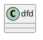

依赖注入，
<!-- more -->
# 基础篇
## spring 4.0新特性
spring框架本身是由Java 8.0编译器编译的，编译时使用的是生成Java 6字节码的编译命令选项，因此可以使用Java6.0、7.0或8.0来运行Spring4.0的应用。

1. 全面支持Java 8
2. 核心容器增强
3. 支持用Groovy定义Bean
4. web的增强
5. 支持websocket
6. 测试的增强

## AOP编程
## 在IoC容器中装配Bean
01. spring配置概述
02. Bean的基本配置
03. 依赖注入
04. 注入参数详解
05. 方法注入
06. &lt;bean&gt;之间的关系&lt;孩子要紧&gt;
07. 整合多个配置文件
08. Bean作用域
09. FactoryBean
10. 基于注解的配置
11. 基于Java类的配置
12. 基于Groovy DSL的配置
13. 通过编码方式动态添加Bean