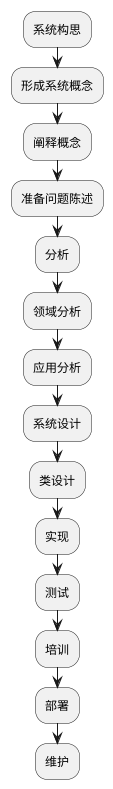

可复用、可扩展和可理解的程序才是好程序
<!-- more -->

# 系统构思
# 领域分析
# 应用分析
# 系统设计
# 类设计
# 实现建模
# oo语言
# 数据库
# 程序设计风格
## 可复用

# 建模是一种设计技术
# 类建模
## 对象和类的概念
## 链接和关联的概念
## 泛化和继承
## 高级对象和类的概念
## 关联端
## n元关联
## 聚合
## 抽象类
## 多重继承
## 元数据
## 具体化
## 约束
## 派生数据
## 包
# 状态建模
## 事件
## 状态
## 迁移和状态
## 状态图
## 状态图行为
## 嵌套状态图
## 嵌套状态
## 信号泛化
## 并发
## 类和状态模型的关系
# 交互建模
## 用例模型
## 顺序模型
## 活动模型
## 用例关系
## 过程式顺序模型
## 活动模型的特殊结构